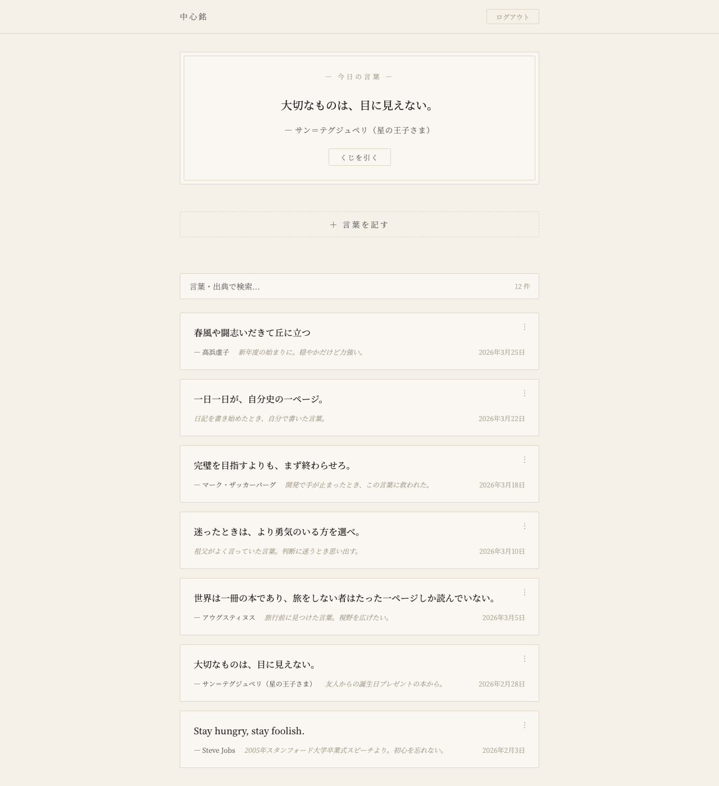
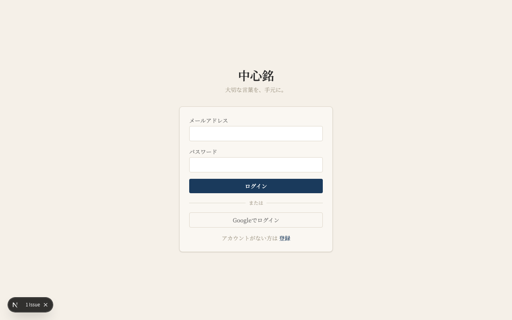

# 中心銘（ちゅうしんめい）

> 大切な言葉を、手元に。

> ブランドの核・トーン・ビジュアル指針は [`BRAND.md`](BRAND.md) を参照（コピー・画面追加・配色の判断基準）。

読書や日常で出会った心に響く言葉を、出典やメモとともに記録・整理し、毎日ランダムに振り返れるパーソナル名言管理アプリです。「今日の言葉」で過去に記した言葉と再会でき、OGP対応の共有リンクで大切な言葉を誰かに贈ることもできます。和紙のような温かみのあるデザインで、言葉と静かに向き合う体験を提供します。

## スクリーンショット

| メイン画面 | 共有ページ | ログイン |
|:---:|:---:|:---:|
|  |  |  |

## 主な機能

- **言葉の記録** — テキスト・出典/作者・メモを添えて CRUD 管理（カード上でインライン編集）
- **今日の言葉** — 日替わりでランダムに1つを表示。「くじを引く」でシャッフルも可能
- **検索** — 言葉・出典・メモを横断してリアルタイム絞り込み
- **共有リンク** — 個別の言葉を OGP 付きの固有 URL（`/shared/[shareId]`）で公開
- **SNS シェア** — X・LINE・Facebook への投稿、OS 標準の共有シート（モバイル）、URL コピー（非セキュア環境向けフォールバック付き）に対応。自分の一覧と公開ページの双方から共有可能。引用文の二重表示を避けるため共有メッセージ本文は URL のみとし、言葉・出典は OGP カードに集約
- **OGP カード画像（動的生成）** — シェア時に SNS のプレビューへ和紙基調のブランドカード画像（`og:image` / Twitter `summary_large_image`）を表示し、`og:title` / `og:description` に言葉・出典を掲載。カード画像は `app/opengraph-image.tsx` が Next.js の `ImageResponse` で動的生成（ブランドシンボル＋ワードマーク＋タグライン。明朝はGoogle Fontsから使用文字だけをサブセット取得）。未認証のSNSクローラーが取得できるよう `/opengraph-image`・`/apple-icon` を `proxy.ts` の公開パスに追加
- **アカウント設定** — 右上のアカウントメニューから設定ページ（`/account`）へ遷移し、表示名・メールアドレス・パスワードの変更、アカウント削除を操作可能。ログアウトはメニューに集約
- **プロフィール画像** — アカウント設定からアイコン画像をアップロード・差し替え・削除（Supabase Storage の `avatars` バケットに保存）。アップロード時にズーム・位置を調整して円形に切り抜き可能（`react-easy-crop`）。未設定時は表示名の頭文字を表示
- **楽観的 UI / 読み込みスケルトン** — 削除を即座に反映し体感速度を向上。サーバー応答待ちの間は `app/loading.tsx` のスケルトンを即時表示し、画面が真っ白になる時間をゼロに
- **お試しモード（登録不要）** — `/try` でアカウント登録なしにアプリ本体を体験できる。サンプルの言葉が数件プリセットされた状態で表示され、その場で追加・編集・削除が可能。データはブラウザの `localStorage` にのみ保存され、新規登録するとホーム初回表示時に「お試しで作成した言葉を取り込みますか？」と確認のうえアカウントへ引き継げる。ログイン／登録画面から導線を用意し、初見ユーザーの登録ハードルを下げる
- **登録時の確認メール案内** — メール確認ON環境では `signUp` 直後にセッションが張られないため、トップへリダイレクトせず「確認メールを送信しました」案内パネルを表示（差出人「中心銘」と送信先アドレスを明記）。無言でログイン画面に戻ってしまう問題を解消し、`/try` から登録した場合はお試しデータ引き継ぎの案内も添える

## 技術スタック

| カテゴリ | 技術 |
|---------|------|
| フロントエンド | Next.js 16（App Router）, React 19, TypeScript |
| スタイリング | Tailwind CSS 4, Noto Serif JP（引用・ブランド） / Noto Sans JP（UI）（Google Fonts） |
| バックエンド | Supabase（PostgreSQL + Auth + Storage + Row Level Security） |
| 認証 | Supabase Auth（Email / Password） |
| 画像クロップ | react-easy-crop（クライアント側で円形クロップ・ズーム） |
| テスト | Vitest（単体）, Playwright（E2E スモーク） |
| CI / 監視 | GitHub Actions（lint / typecheck / test / build / E2E）, Sentry（任意・エラーモニタリング） |
| デプロイ | Vercel |

## 設計のポイント

- **Server Components / Server Actions** を中心に構成し、データ取得はサーバー、対話部分のみ Client Component に分離
- **Row Level Security（RLS）** に加え、各 Server Action 内でも認証・所有者チェックを行う多層防御。DB 書き込みは戻り値の `error` を必ず検査し、失敗を握り潰さずユーザーへ通知
- **セキュリティ・ハードニング** — 商用運用に向けて以下を実施。
  - **確認メール／リセットリンクの起点を固定** — リダイレクト URL を信頼できる `NEXT_PUBLIC_SITE_URL` から生成し、偽装可能な `Host` ヘッダに依存しない（リンク汚染による `token_hash` 奪取の防止）。
  - **公開言葉の列挙防止** — 匿名ユーザーには `words` テーブルへの直接 SELECT を与えず、`share_id` 指定で1行だけ返す `SECURITY DEFINER` 関数 `get_shared_word()` 経由に限定（`/shared/[shareId]`）。`is_public=true` の全件列挙を遮断。
  - **アバター画像の MIME ホワイトリスト** — 公開バケットでの Stored XSS を防ぐため、`image/svg+xml` 等を排除しラスタ画像（JPEG / PNG / WebP / GIF）のみ許可。
  - **セッション Cookie の確実な引き継ぎ** — `proxy.ts` の未認証リダイレクトでもトークン更新 Cookie をレスポンスへコピーし、セッション早期切れを防止。
- **入力バリデーション** — 言葉の文字数上限を純関数（`lib/utils/word-validation.ts`）に切り出してアプリ側で検証しつつ、DB の `CHECK` 制約でも同じ上限を担保。純関数は Vitest で単体テスト済み
- **`proxy.ts`**（Next.js 16 で `middleware.ts` から改名された規約）でセッション更新と未認証リダイレクトを実装。検証済みの `user.id` / `email` をリクエストヘッダ（`x-user-id` / `x-user-email`）で下流に渡し、page・Header での重複 `getUser()` を排除
- **初回表示の最適化** — トップページでは `words` と `profiles` を `Promise.all` で並列取得し、結果を Header に props で受け渡し（Header は同期 Server Component 化）。`app/loading.tsx` でスケルトンを即時表示し体感速度を向上
- **日付ベースのハッシュ** で「今日の言葉」を同一ユーザー・同一日には同じ結果に
- **OGP メタデータ動的生成** で共有リンクの SNS プレビューに言葉と作者を表示
- **アカウント管理** — ログアウト・設定への入口を右上メニューに集約（ヒューリスティック評価に基づく導線設計）。本人によるアカウント削除は `SECURITY DEFINER` 関数 `delete_own_account()` 経由で自分の行のみを削除し、`ON DELETE CASCADE` で言葉・プロフィールを連動削除
- **プロフィール画像** — クライアント側でズーム・位置調整して円形に切り抜き、512px に縮小して Supabase Storage（`avatars` バケット）へアップロード。ストレージの RLS で「閲覧は公開／書き込みは本人フォルダ（`{uid}/...`）のみ」を保証し、`profiles.avatar_url` に公開 URL を保存（キャッシュ無効化のため `?v=` を付与）
- **書体の役割分担（和×モダン）** — 「作品」と「情報」を書体で分離。**引用文・出典/作者・メモ・ブランドワードマーク「中心銘」は明朝（Noto Serif JP）**、**フォーム・ボタン・ラベル・見出し・日付などのUIはサンセリフ（Noto Sans JP）**を既定とする。`app/layout.tsx` で両フォントを CSS 変数（`--font-noto-serif` / `--font-noto-sans`）として読み込み、`app/globals.css` の `@theme` で `--font-serif` / `--font-sans` にマッピング。本文既定はサンセリフで、明朝は `font-serif` クラスで明示的に適用（方針は [`BRAND.md`](BRAND.md) §9）
- **ブランドの一貫性（シンボル＋朱の一点）** — ファビコン（`app/icon.svg`）・Apple アイコン（`app/apple-icon.tsx`）・OGP カード（`app/opengraph-image.tsx`）を、和紙色・明朝体・editorial navy（accent）で統一。ブランドシンボルは**文字を使わない抽象マーク**＝墨の角枠の中心に**朱の一点**（中心＝core／朱＝銘）。朱は差し色トークン `--accent-vermilion`（危険色 `--danger` とは別用途）として定義し、UI ではワードマーク脇の小さな点として**一点主義**で使用（方針は [`BRAND.md`](BRAND.md) §9）
- **お試しモードの分離設計** — 動作実績のある認証済み CRUD（`WordsClient` / 既存 Server Actions / `proxy.ts` の認証ガード）には手を入れず、お試し機能を独立系統として追加。`proxy.ts` の公開パス判定に `/try` を1条件足すだけで未認証アクセスを許可し、UI は `localStorage` 駆動の `TryWordsClient`、引き継ぎは `bulkAddWords` Server Action で実装。検証（`validateWord`）・トースト・確認ダイアログは既存の純粋な部品を再利用。引き継ぎは登録直後ではなくホーム到達後（session 確立後）に行い、メール確認 ON 環境でも確実に処理
- **メール確認リンクの方式統一** — 新規登録の確認リンクは PKCE の code 方式だと code_verifier がメールリンク経由で失われ、別ブラウザ／スマホで開くとログインできない。パスワードリセットと同じく **token_hash 方式**に統一し、`app/auth/callback/route.ts` で `code`（OAuth）と `token_hash`（メール確認）の両方を `verifyOtp` 等で処理

## セットアップ

### 1. 依存のインストール

```bash
npm install
```

### 2. Supabase プロジェクトの用意

[Supabase](https://supabase.com) でプロジェクトを作成し、`Project Settings > API` から URL と publishable（anon）キーを取得します。

### 3. 環境変数の設定

`.env.local.example` を `.env.local` にコピーして値を設定します。

```bash
cp .env.local.example .env.local
```

```env
NEXT_PUBLIC_SUPABASE_URL=https://xxxx.supabase.co
NEXT_PUBLIC_SUPABASE_ANON_KEY=your-publishable-key
# 本番のみ必須。確認メール/リセットリンクの生成に使う信頼できるサイトURL（末尾スラッシュなし）
NEXT_PUBLIC_SITE_URL=https://your-production-domain
```

> `NEXT_PUBLIC_SITE_URL` は確認メールやパスワードリセットのリンクの起点になります。以前はリクエストの `Host` ヘッダから生成していましたが、偽装によりリンクが攻撃者ドメインに向く恐れがあったため、信頼できる環境変数に固定しました。ローカル開発では未設定で `http://localhost:3000` にフォールバックします。**本番でこの変数が未設定だとパスワードリセット等が実行時エラーになります。**

### 4. データベーススキーマの適用

Supabase ダッシュボードの `SQL Editor` で [`supabase-schema.sql`](supabase-schema.sql) を実行します（テーブル・RLS ポリシー・プロファイル自動生成トリガーを作成）。

> 新しいテーブルを追加する際は、Data API（supabase-js / PostgREST）からアクセスするため必ず `GRANT` 文を含めてください（詳細はスキーマ冒頭のコメント参照）。

> アカウント削除機能には `delete_own_account()` 関数が必要です。`supabase-schema.sql` に含まれているため新規セットアップでは自動で作成されます。既存プロジェクトには [`supabase-migration-delete-account.sql`](supabase-migration-delete-account.sql) を一度だけ実行してください。

> プロフィール画像機能には `profiles.avatar_url` 列と `avatars` ストレージバケット（＋RLS）が必要です。新規セットアップは `supabase-schema.sql` に含まれます。既存プロジェクトには [`supabase-migration-avatar.sql`](supabase-migration-avatar.sql) を一度だけ実行してください。

> 言葉の入力長制限（`text` 1〜2000 / `author` ≤200 / `memo` ≤2000 文字）は新規セットアップでは `supabase-schema.sql` に含まれます。既存プロジェクトには [`supabase-migration-word-limits.sql`](supabase-migration-word-limits.sql) を一度だけ実行してください（アプリ側のバリデーションと同じ上限を DB でも担保する多層防御）。

> 共有ページの公開言葉取得は `get_shared_word()` 関数（`share_id` 指定で1行のみ返す）経由に限定しています。これは未認証ユーザーが Data API で `is_public=true` の言葉を**全件列挙**できてしまう問題を防ぐためで、`anon` ロールには `words` テーブルへの直接 SELECT を与えていません。新規セットアップは `supabase-schema.sql` に含まれます。既存プロジェクトには [`supabase-migration-share-rpc.sql`](supabase-migration-share-rpc.sql) を一度だけ実行してください。

### 5. メールテンプレート・送信者（SMTP）の設定

認証メール（パスワードリセット・新規登録の確認）は、PKCE の code_verifier がメールリンク経由で失われる問題を避けるため、いずれも **token_hash 方式**を採用しています。Supabase ダッシュボードで以下を設定してください。

#### URL 設定（`Authentication > URL Configuration`）
- **Site URL**: 開発時は `http://localhost:3000`、本番はデプロイ先 URL（確認リンクの既定の戻り先になります）
- **Redirect URLs**: `http://localhost:3000/auth/callback` および本番 URL の `/auth/callback`。**セキュリティ上、`/**` のワイルドカードは避け、利用するURLを確定で列挙することを推奨します**（万一リンクが汚染されても許可外のドメインへは飛ばさないための多層防御）

#### メールテンプレート（`Authentication > Email Templates`）
- **Reset Password** のリンクを次の形式に変更

  ```html
  <a href="{{ .SiteURL }}/auth/update-password?token_hash={{ .TokenHash }}&type=recovery">
    パスワードを再設定する
  </a>
  ```

- **Confirm signup**（新規登録の確認）のリンクを次の形式に変更。デフォルトの `{{ .ConfirmationURL }}` は code 方式のため、別ブラウザ／スマホでリンクを開くとセッションが張れず `/auth/login` に弾かれます。`token_hash` 方式にすると `app/auth/callback/route.ts` が `verifyOtp` で検証し、そのままログインできます

  ```html
  <a href="{{ .SiteURL }}/auth/callback?token_hash={{ .TokenHash }}&type=email">
    メールアドレスを確認する
  </a>
  ```

  > `type=email` で確認できない環境では `type=signup` を使用します（コールバックは URL の `type` をそのまま `verifyOtp` に渡すため、テンプレート側の変更だけで切り替え可能）。

#### 送信者名・差出人（任意：Custom SMTP）
差出人を「中心銘」にするには `Authentication > Emails > SMTP Settings` で Custom SMTP を有効化します（組み込みメールは差出人名を変更できず、送信上限も低いため本番非推奨）。
- **Sender name**: `中心銘` / **Sender email**: 認証済みのアドレス
- 独自ドメインがあれば Resend / SendGrid / Amazon SES を、無ければ Gmail（`smtp.gmail.com` / Port `465` / Username＝Gmail アドレス / Password＝Google の「アプリパスワード」）でも可。Gmail を使う場合、Sender email・Username・アプリパスワードはすべて**同一の Google アカウント**に揃える必要があります。

### 6. （任意）デモデータの投入

[`supabase-seed-demo.sql`](supabase-seed-demo.sql) 内の `YOUR_USER_ID` を実際の `auth.users` の UUID に置き換えてから SQL Editor で実行すると、サンプルの言葉が登録されます。

### 7. 開発サーバーの起動

```bash
npm run dev
```

[http://localhost:3000](http://localhost:3000) を開きます。

## スクリプト

| コマンド | 説明 |
|---------|------|
| `npm run dev` | 開発サーバー起動 |
| `npm run build` | 本番ビルド |
| `npm start` | 本番サーバー起動 |
| `npm run lint` | ESLint（フラット設定 / `eslint-config-next`）。Next.js 16 で `next lint` は廃止されたため ESLint CLI を直接使用 |
| `npm test` | Vitest による単体テスト（入力バリデーション・リダイレクト検証などの純関数） |
| `npm run typecheck` | `tsc --noEmit` による型チェック |
| `npm run test:e2e` | Playwright による E2E スモークテスト（公開ページのレンダリング・ルーティング） |

## テスト・CI・モニタリング

- **単体テスト（Vitest）** — 純関数（`lib/utils/*.test.ts`）を対象。
- **E2E スモークテスト（Playwright）** — `e2e/` に配置。ログイン／登録／パスワードリセット／お試しページのレンダリングと、未認証時のトップ→ログインのリダイレクトを検証します。認証・DB を必要としないため、Supabase の値はダミーでも実行できます（`npm run test:e2e`、初回は `npx playwright install chromium` が必要）。認証フローの本格的な E2E はテスト用 Supabase プロジェクトを用意して拡張してください。
- **CI（GitHub Actions）** — `.github/workflows/ci.yml` で PR 時に lint / typecheck / 単体テスト / build / E2E を自動実行します。
- **ヘルスチェック / キープアライブ** — `GET /api/health` はアプリ→Supabase の接続を確認するエンドポイントで、成功時 `{"status":"ok","db":"ok",...}`（HTTP 200）、DB 到達不可時は HTTP 503、`CRON_SECRET` 設定時に認証ヘッダが不正なら HTTP 401 を返します（キー等の詳細は返しません）。匿名で叩けるよう `proxy.ts` の公開パスに含めており、DB へは anon で実行できる唯一のクエリである `get_shared_word()` RPC を1回投げます。`vercel.json` の **Vercel Cron** がこのエンドポイントを **1日1回**自動で叩き、Supabase フリープランの「7日間非アクティブで自動一時停止」を防ぎます。詳細は後述の[「Supabase の自動一時停止を防ぐ」](#supabase-の自動一時停止を防ぐキープアライブ)を参照。
- **エラーモニタリング（Sentry・任意）** — `@sentry/nextjs` を導入済み。`NEXT_PUBLIC_SENTRY_DSN` を設定すると本番のクライアント／サーバーエラーを Sentry に送信します（未設定時は完全に無効で、ビルド・実行に一切影響しません）。ソースマップを Sentry にアップロードする場合のみ `SENTRY_ORG` / `SENTRY_PROJECT` / `SENTRY_AUTH_TOKEN` を設定してください。

## デプロイ

[Vercel](https://vercel.com) にインポートし、環境変数（`NEXT_PUBLIC_SUPABASE_URL` / `NEXT_PUBLIC_SUPABASE_ANON_KEY` / `NEXT_PUBLIC_SITE_URL`）を設定するだけでデプロイできます。`NEXT_PUBLIC_SITE_URL` には本番ドメイン（例: `https://chushinmei.example.com`）を設定してください。Supabase 側の Site URL / Redirect URLs に本番 URL を追加するのも忘れずに。

### Supabase の自動一時停止を防ぐ（キープアライブ）

Supabase のフリープランは **7日間アクティビティがない**とプロジェクトを自動で一時停止します（復旧はダッシュボードの「Restore project」ボタンで手動）。これを防ぐため、[`vercel.json`](vercel.json) に定義した **Vercel Cron** が本番の `GET /api/health` を **1日1回**自動で叩き、実際に DB へ軽量クエリ（`get_shared_word()` RPC）を投げます。ヘルスチェックと停止防止を1本で兼ねる構成です。

```json
{
  "crons": [{ "path": "/api/health", "schedule": "0 3 * * *" }]
}
```

- **ほぼセットアップ不要・完全自動** — `vercel.json` が本番にデプロイされた時点で Vercel が cron を自動登録し、以降は毎日自動実行されます。手動トリガーや外部サービスは不要です。登録状況は Vercel ダッシュボードの **Settings → Cron Jobs** で確認できます。
- **無認証アクセスの防止（`CRON_SECRET`）** — `GET /api/health` は公開エンドポイントのため、環境変数 `CRON_SECRET` を設定すると、Vercel Cron が自動付与する `Authorization: Bearer <CRON_SECRET>` ヘッダを検証し、一致しないリクエストには **401** を返します。値は `openssl rand -hex 32` などで生成し、Vercel の **Settings → Environment Variables** に Production として登録します（Vercel Cron 側は自動でヘッダを付けるため追加設定不要）。未設定の環境（ローカル/プレビュー）では検証をスキップします。
- **頻度の根拠** — Supabase の停止は7日間なので、日次なら1回取りこぼしても約6日の余裕が残ります。Vercel Hobby は cron の最小間隔が「1日1回」・精度は時間単位（`0 3 * * *` は 03:00〜03:59 UTC の間に発火）で、keepalive 用途には十分です。
- **なぜ GitHub Actions を使わないか** — GitHub のスケジュール実行はデフォルトブランチが60日更新されないと自動無効化され、それを回避する「活動維持コミット」は GitHub の利用規約（人工的な活動生成）に抵触するおそれがあります。Vercel Cron はアプリと同じ基盤に内包され、この問題を根本的に回避します。

### パフォーマンス計測（任意）

Vercel ダッシュボードの **Speed Insights** を有効化すると、本番環境の Core Web Vitals（LCP / TTFB / CLS / INP）を継続的に計測できます。最適化の効果検証や、リージョン設定（必要なら Function Region を Supabase と同じリージョンに合わせる）の判断に有用です。

## 補足

- Google OAuth はコード上に実装済みですが、現在は UI を非表示にしています（再有効化時は `lib/actions/auth-actions.ts` の `loginWithGoogle` とログイン画面のボタンを復帰）。
